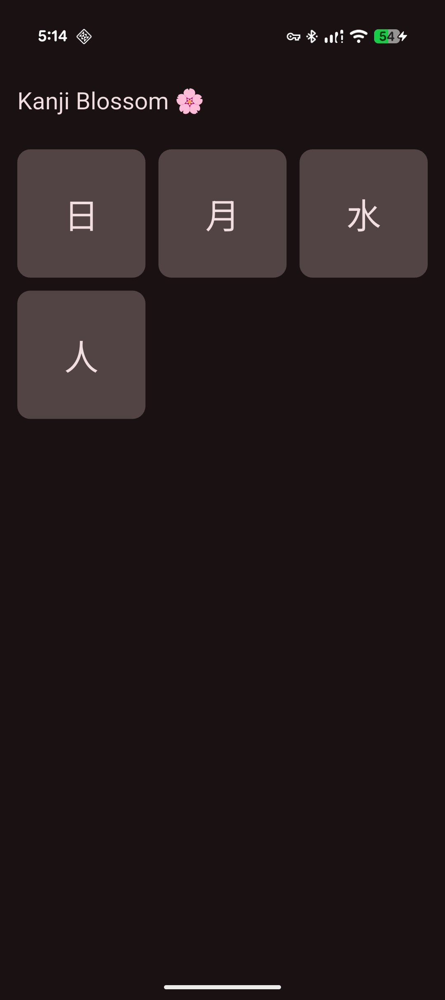
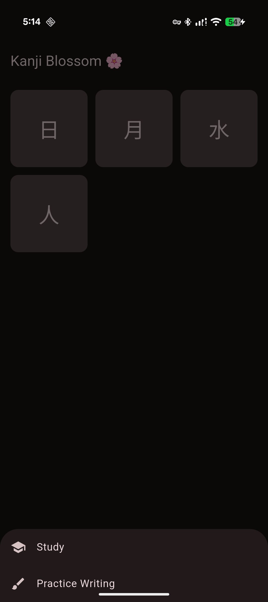
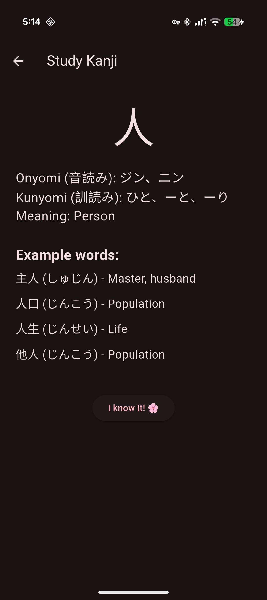
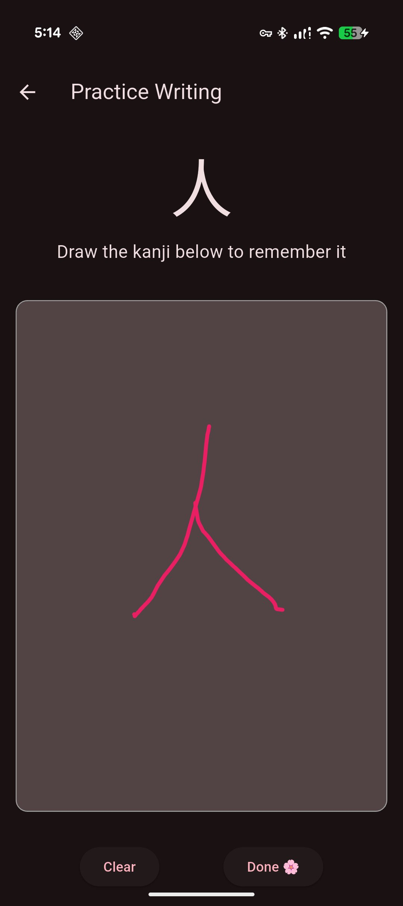

# 🌸 Kanji Blossom 

Kanji Blossom is a Flutter-based mobile application inspired by Kanji Blossom and Duolingo.  
It helps learners study Japanese kanji through **visual learning**, **examples**, and **guided writing practice** using stroke templates.

The app is designed with **Material You**, supports **light and dark themes**, and focuses on clean, modular code architecture.

---

## ✨ Features

- 📚 Kanji study mode with meanings, readings, and example words
- ✍️ Writing practice with **stroke guide (tracing template)**
- 🎯 Smart practice validation based on stroke matching
- 🌗 Light & Dark themes (Material You)
- 🌸 Kanji progress tracking (learned / not learned)
- 🧩 Modular and scalable project structure
- 📂 Kanji database stored in a separate file for easy extension

---

## 📱 Screenshots

> 📌 Replace the image files with your real screenshots  
> Example resolution: 1080×2400 (portrait)

<table style= "width: 100%">
<tr>
### 🏠 Home Screen (Kanji Grid)

---

### 📂 Kanji Actions Menu (Study / Practice)

---

### 📖 Study Screen (Kanji Details)

- Meaning
- Onyomi & Kunyomi
- Example words with readings

---

### ✍️ Practice Screen (Kanji Tracing)

- Semi-transparent kanji template
- User draws directly over the strokes
- Stroke snapping & validation

---
</tr>
</table>

## 🧠 How Practice Mode Works

- Each kanji has a **stroke template**
- The template is drawn as a light guide
- The user traces over it with their finger
- If the drawn strokes are close enough to the template:
  - The stroke is marked as completed
- When **all strokes are completed**, the kanji is marked as *learned*

This approach mimics the behavior of **Kanji Blossom** and **Duolingo**.

---

## 📁 Project Structure

